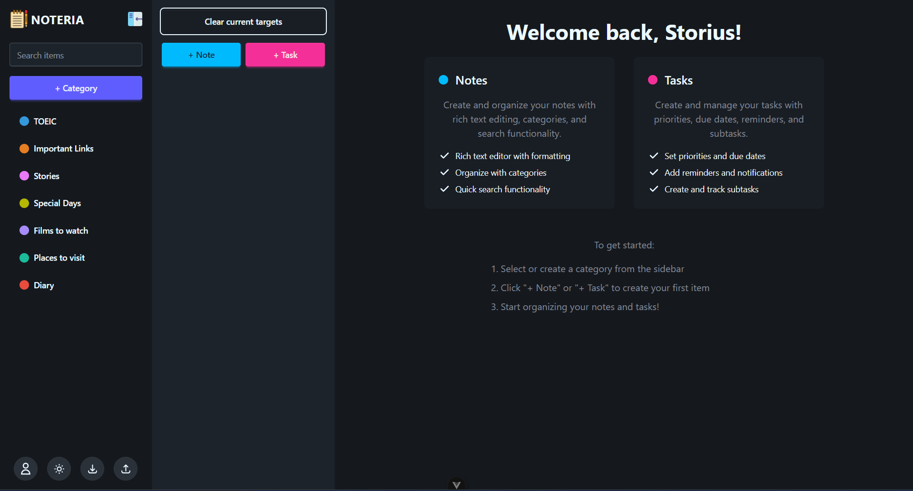

# 📝 Noteria

Noteria is a modern, full-featured note-taking and productivity app designed to help you organize your thoughts, tasks, and life—all in one place. With a clean interface, powerful features, and seamless user experience, Noteria is perfect for students, professionals, and anyone who wants to stay organized.

(NOTE!!! Due to only using Render's free plan for now to deploy, you have to wait for about 1 minute to be able to use the app, and the respond is pretty slow.)
https://noteria-frontend.onrender.com/

---

## 🚀 Features

-   **🗂️ Categories:** Organize your notes and tasks into color-coded categories.
-   **📝 Rich Notes:** Create and edit notes with rich text formatting.
-   **✅ Tasks & Subtasks:** Manage tasks, set priorities, due dates, and break them down into subtasks.
-   **🔔 Reminders:** Get notified about important tasks via email or in-app notifications.
-   **📅 Special Days:** Track birthdays, anniversaries, and other important dates.
-   **🔗 Quick Links:** Save and access important links easily.
-   **🌙 Dark Mode:** Enjoy a beautiful, distraction-free dark theme.
-   **🔒 Secure Authentication:** JWT-based login and registration.
-   **🖱️ Drag & Drop:** Reorder categories and tasks with ease.
-   **🌐 Responsive:** Works great on desktop and mobile devices.

---

## 📸 Screenshots



---

## 🛠️ Tech Stack

-   **Frontend:** Vue 3, Pinia, Tailwind CSS, Axios
-   **Backend:** Node.js, Express, MongoDB, Mongoose, JWT
-   **Other:** Nodemailer (email reminders), Flatpickr (date picker), Toast notifications,...

---

## ⚡ Quick Start

### 1. Clone the repository

```bash
git clone https://github.com/yourusername/noteria.git
cd noteria
```

### 2. Install dependencies

```bash
# Backend
cd Backend
npm install

# Frontend
cd ../Frontend
npm install
```

### 3. Set up environment variables

-   Copy `.env.example` to `.env` in both `Backend` and `Frontend` folders and fill in your configuration.

### 4. Run the app

```bash
# Start backend
cd Backend
npm run dev

# Start frontend
cd ../Frontend
npm run dev
```

---

## 🤝 Contributing

Pull requests are welcome! For major changes, please open an issue first to discuss what you would like to change.

---

> Made with ❤️ by Storius (Hieu Pham)
